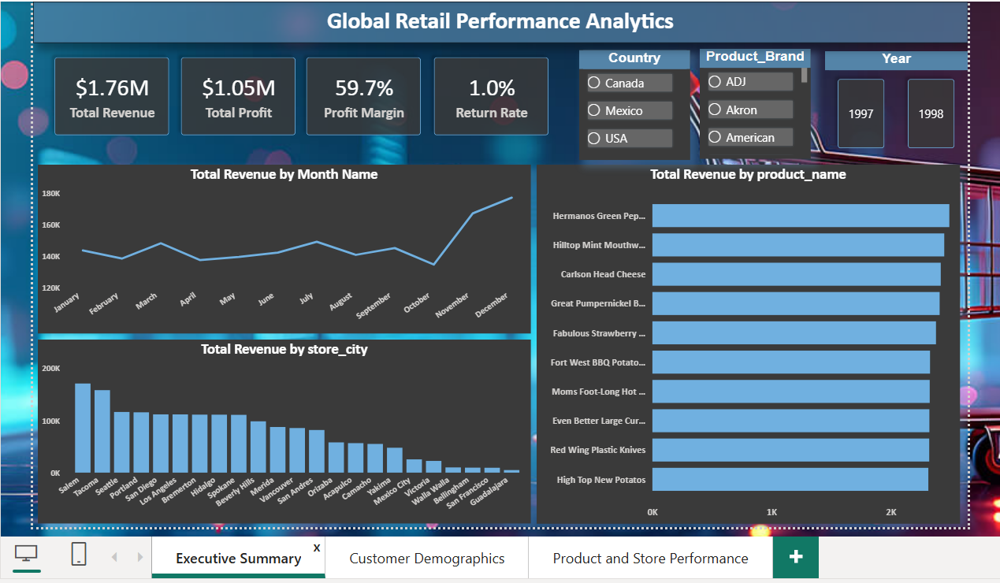

# 🌍 Global Retail Performance Analytics Dashboard

An end-to-end **Power BI Business Intelligence project** designed to analyze global retail sales, customer demographics, product performance, and store profitability. This interactive dashboard provides actionable insights through dynamic visualizations, KPI reporting, and data-driven analysis.

---

## 📌 Project Overview

The objective of this project is to transform raw retail data into meaningful business insights using Power BI. The dashboard enables users to monitor key performance indicators, analyze sales trends, evaluate store performance, and understand customer purchasing behavior.

---

## 🎯 Objectives

- Analyze overall retail business performance.
- Track Revenue, Profit, Profit Margin, and Return Rate.
- Monitor monthly sales trends.
- Identify top-performing products and store locations.
- Analyze customer demographics and purchasing patterns.
- Compare performance across different store types.

---

## 📊 Dashboard Pages

### 📈 1. Executive Summary
Provides a high-level overview of business performance.

**Highlights**
- KPI Cards
  - Total Revenue
  - Total Profit
  - Profit Margin
  - Return Rate
- Monthly Revenue Trend
- Revenue by Product
- Revenue by Store City
- Interactive Filters
  - Country
  - Product Brand
  - Year

---

### 👥 2. Customer Demographics
Analyzes customer purchasing behavior and revenue contribution.

**Highlights**
- Customer Revenue & Profit
- Total Transactions
- Revenue by Occupation
- Revenue by Gender
- Revenue by Marital Status

---

### 🏪 3. Product & Store Performance
Evaluates profitability across products and store types.

**Highlights**
- Store Performance Matrix
- Revenue, Profit & Profit Margin by Store Type
- Product Cost vs Revenue Scatter Plot
- Product Brand Analysis

---

## 📸 Dashboard Preview

### Executive Summary

]

---

### Customer Demographics


---

### Product & Store Performance


---

## 📊 Key KPIs

| KPI | Description |
|------|-------------|
| Total Revenue | Overall business revenue |
| Total Profit | Total profit generated |
| Profit Margin | Profit as a percentage of revenue |
| Return Rate | Percentage of returned products |

---

## 🛠 Tools & Technologies

- Power BI
- DAX
- Power Query
- Data Modeling
- Microsoft Excel
- Data Visualization
- Business Intelligence

---

## 📂 Repository Structure

```
Global-Retail-Performance-Analytics
│
├── Dashboard
│   ├── Global Retail Performance Analytics.pbix
│   └── README.md
│
├── Dataset
│   ├── Retail Dataset.xlsx
│   └── README.md
│
├── Images
│   ├── Executive Summary.png
│   ├── Customer Demographics.png
│   ├── Product and Store Performance.png
│   └── README.md
│
└── README.md
```

---

## 💡 Key Business Insights

- Deluxe Supermarkets generated the highest revenue and profit.
- Revenue increased significantly during the final months of the year.
- Professional occupation customers contributed the highest revenue.
- Revenue distribution across gender and marital status remained balanced.
- Product profitability varied across different brands.
- Store performance analysis highlighted differences among store types.

---

## 🚀 Skills Demonstrated

- Data Cleaning
- Data Transformation
- Data Modeling
- DAX Measures
- Power Query
- KPI Development
- Dashboard Design
- Interactive Reporting
- Business Intelligence
- Retail Analytics
- Data Visualization

---

## 📬 Contact

If you have any feedback or suggestions, feel free to connect with me on LinkedIn.

⭐ If you found this project useful, consider giving this repository a star!
